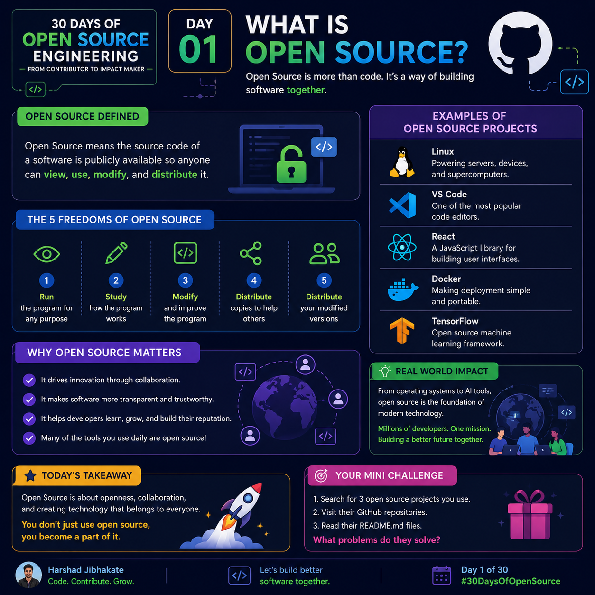

# Day 01 — What is Open Source?

<p align="center">

</p>

# 🎯 Today's Goal

By the end of this lesson, you will understand:

- What Open Source actually means
- Why millions of developers contribute for free
- How Open Source powers modern software
- How you can become an Open Source contributor

---

# 🤔 What is Open Source?

Open Source Software (OSS) is software whose **source code is publicly available**.

Anyone can:

- 👀 View the source code
- 📥 Download it
- ✏️ Modify it
- 🚀 Improve it
- 🔄 Share it with others

Unlike closed-source software, the code is open for everyone to learn from and contribute to.

> Open Source is not just free software.
>
> It is software built together by people all around the world.

---

# 📦 Closed Source vs Open Source

| Closed Source | Open Source |
|--------------|-------------|
| Source code is hidden | Source code is public |
| Only company developers can edit | Anyone can contribute |
| Limited transparency | Completely transparent |
| Controlled by one organization | Community driven |
| Examples: Windows, Photoshop | Examples: Linux, React, VS Code |

---

# 🌍 Why Open Source Matters

Imagine every developer had to build everything from scratch.

Need authentication?

Write it yourself.

Need a web server?

Build it yourself.

Need a database?

Create one yourself.

That would take years.

Instead, developers use Open Source software to build faster.

Modern software exists because developers collaborate.

---

# 💡 Real-Life Examples

Almost everything you use every day depends on Open Source.

| Product | Uses Open Source |
|----------|-----------------|
| Android | Linux Kernel |
| Chrome | Chromium |
| VS Code | Open Source |
| Docker | Open Source |
| Kubernetes | Open Source |
| React | Open Source |
| Node.js | Open Source |
| Python | Open Source |
| TensorFlow | Open Source |

Even companies like:

- Google
- Microsoft
- Meta
- Netflix
- Amazon

actively contribute to Open Source projects.

---

# 🧠 Real Example

Suppose you want to build a website.

Instead of creating everything yourself:

❌ Build JavaScript framework

❌ Build CSS engine

❌ Build HTTP server

❌ Build Database

You simply use:

- React
- Node.js
- Express
- MongoDB

All of these are Open Source.

Instead of spending 5 years...

You can build an application in a few weeks.

That's the power of Open Source.

---

# 🔍 What is Source Code?

Source code is simply the human-readable code written by developers.

Example:

```python
def greet(name):
    return f"Hello {name}"

print(greet("Harshad"))
```

If this project is Open Source,

everyone can:

- Read it
- Improve it
- Fix bugs
- Add features
- Learn from it

---

# 🏗 How Open Source Works

```
Developer A
      │
      ▼
Uploads project to GitHub
      │
      ▼
Developers around the world
      │
      ▼
Find Bugs
Add Features
Improve Documentation
Review Code
      │
      ▼
Project becomes better
```

This cycle continues for years.

---

# 🌟 Famous Open Source Projects

- Linux
- React
- Vue
- Angular
- Node.js
- Docker
- Kubernetes
- VS Code
- Python
- TensorFlow
- Flutter
- PostgreSQL

Millions of developers use these every day.

---

# 🎯 Benefits of Open Source

✅ Learn from experienced developers

✅ Read production-quality code

✅ Build your GitHub profile

✅ Improve coding skills

✅ Network with developers

✅ Get noticed by recruiters

✅ Gain real-world experience

---

# ⚠ Common Misconceptions

### ❌ Open Source means Free

Not always.

Some Open Source software is commercial.

Open Source refers to the availability of the source code—not necessarily the price.

---

### ❌ Anyone can change the project directly

No.

Anyone can suggest changes.

Project maintainers review and decide whether to accept them.

---

### ❌ Beginners cannot contribute

Wrong.

Many projects welcome beginners through:

- Documentation
- Bug reports
- Typo fixes
- README improvements
- Good First Issues

---

# 💻 Practical Exercise

Visit GitHub and search for:

- React
- VS Code
- Docker

Observe:

- README
- Contributors
- Pull Requests
- Issues
- Stars
- Forks

Write down:

- How many contributors?
- How many stars?
- What problem does the project solve?

---

# 🎯 Mini Challenge

Find **three Open Source projects** that you use.

For each one answer:

- What problem does it solve?
- Who maintains it?
- How many stars does it have?
- Would you like to contribute one day?

---

# 🧠 Key Takeaways

- Open Source means the source code is publicly available.
- Anyone can learn from it.
- Anyone can contribute improvements.
- Most modern software depends on Open Source.
- Open Source helps developers learn faster and build better software.

---

# 🚀 What's Next?

Tomorrow you'll learn:

# Day 02 — How GitHub Projects Work

We'll understand:

- Repository structure
- Branches
- Issues
- Pull Requests
- Contributors
- Stars
- Forks
- Releases

and how all of them work together in a real Open Source project.

---

## ⭐ If you learned something new today,

Give this repository a ⭐ Star and continue to **Day 02**.

Happy Coding! 🚀