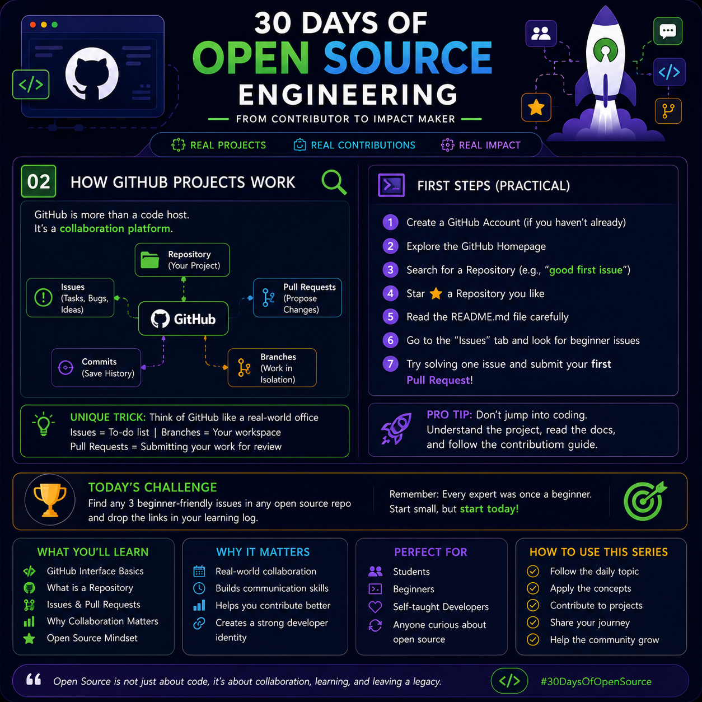

# Day 02 – How GitHub Projects Work

> **Series:** 30 Days of Open Source Engineering  
> **Day:** 02  
> **Topic:** How GitHub Projects Work

---
<p>

</p>
# 🎯 Goal

Understand how an open-source project is organized on GitHub and how contributors collaborate without directly editing the main code.

---

# 🚀 GitHub Is More Than a Code Hosting Platform

GitHub is a collaboration platform where developers from around the world work together.

Instead of sending code through emails or chat, contributors use GitHub's workflow to discuss, review, improve, and merge code safely.

---

# 🧩 Core Components

## 📁 Repository

A repository (repo) is the home of a project.

It contains:

- Source code
- Documentation
- Issues
- Pull Requests
- Release history
- Project settings

Think of it as the project's workspace.

---

## 🐞 Issues

Issues are used to track:

- Bugs
- Feature requests
- Improvements
- Questions
- Tasks

Before writing code, contributors usually select or create an Issue.

---

## 🌿 Branches

A branch is an independent workspace.

Instead of changing the main project directly, developers create a branch where they safely make changes.

Example:

```
main
│
├── feature-login
├── fix-navbar
└── update-readme
```

Branches keep development isolated until it's reviewed.

---

## 💾 Commits

A commit is a saved snapshot of your work.

Each commit should explain **what changed** and **why**.

Example:

```
feat(auth): Add Google Login

fix(api): Handle timeout errors

docs: Update installation guide
```

Good commit messages make project history easy to understand.

---

## 🔀 Pull Request (PR)

A Pull Request is a request to merge your branch into the main project.

It includes:

- Your code changes
- Description
- Screenshots (optional)
- Linked Issue
- Review discussion

Maintainers review your work before merging it.

---

# 🔄 Typical GitHub Workflow

```
Repository
      │
      ▼
Pick an Issue
      │
      ▼
Create a Branch
      │
      ▼
Write Code
      │
      ▼
Commit Changes
      │
      ▼
Open Pull Request
      │
      ▼
Code Review
      │
      ▼
Merge into Main
```

---

# 💡 Easy Memory Trick

Imagine GitHub as a company office.

| GitHub Feature | Real-Life Example |
| --------------- | ------------------- |
| Repository | Office Building |
| Issues | Task List |
| Branch | Personal Workspace |
| Commit | Saving Your Work |
| Pull Request | Submitting Work for Review |
| Maintainer | Team Leader |

This analogy helps you remember the workflow naturally.

---

# ⭐ Beginner's First Steps

1. Create a GitHub account.
2. Explore popular repositories.
3. Read the README carefully.
4. Look for **good first issue** labels.
5. Understand the project structure.
6. Fork the repository (later).
7. Start contributing.

---

# ⚡ Pro Tip

**Never start coding immediately.**

Spend more time understanding:

- README
- CONTRIBUTING.md
- Folder structure
- Existing Issues
- Coding style

Many beginners fail because they skip this step.

---

# 🏆 Today's Challenge

Find **3 beginner-friendly repositories**.

For each repository:

- Read the README.
- Explore the Issues tab.
- Identify one issue you could solve.

Don't write code yet.

Your goal is understanding the project.

---

# 📚 What You'll Learn Today

- GitHub Interface
- Repository Structure
- Issues
- Branches
- Commits
- Pull Requests
- Collaboration Workflow

---

# 🌍 Why It Matters

Learning GitHub workflow helps you:

- Collaborate with developers worldwide.
- Understand professional software development.
- Build a strong public portfolio.
- Prepare for internships and jobs.
- Contribute confidently to open-source projects.

---

# 👥 Perfect For

- Students
- Beginners
- Self-taught Developers
- Open Source Enthusiasts
- Career Switchers

---

# 📝 Key Takeaways

- A Repository is the project's home.
- Issues define what needs to be done.
- Branches isolate your work safely.
- Commits record your progress.
- Pull Requests allow maintainers to review your work.
- Good contributors understand the project before writing code.

---

# 💬 Quote of the Day

> "Great open-source contributors spend more time understanding the project than writing their first line of code."

---

## ⏭️ Next Day

**Day 03 — Finding Beginner-Friendly Issues**
