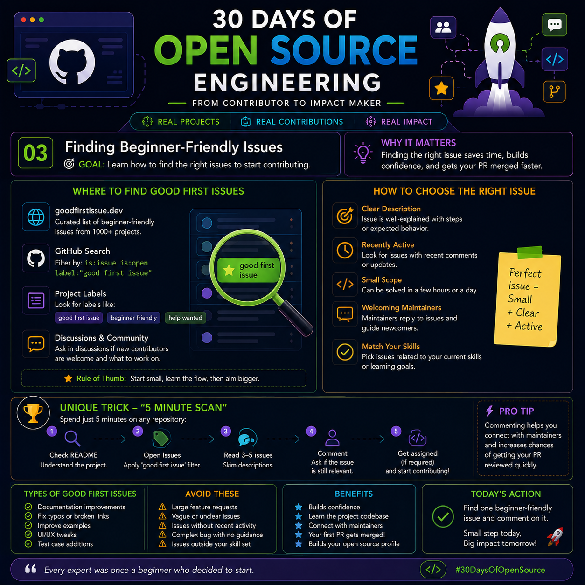

# Day 03 – Finding Beginner-Friendly Issues

<p>

</p>

> **30 Days of Open Source Engineering**
>
> **Goal:** Learn how to find the right issues to start contributing to open source projects.

---

# 🎯 Why This Matters

Finding the **right first issue** is one of the biggest challenges for new contributors.

A well-chosen issue helps you:

- Build confidence
- Understand the project's workflow
- Get your first Pull Request merged faster
- Learn without feeling overwhelmed

The goal is **not** to solve the hardest problem—it's to learn the contribution process.

---

# 🔍 Where to Find Beginner-Friendly Issues

## 1️⃣ goodfirstissue.dev

A website that collects beginner-friendly issues from thousands of GitHub repositories.

Best for:
- First-time contributors
- Learning GitHub workflow
- Small bug fixes

---

## 2️⃣ GitHub Search

Search directly using GitHub filters.

Example:

```text
is:issue is:open label:"good first issue"
```

Useful labels:

- good first issue
- beginner friendly
- help wanted
- documentation
- bug

---

## 3️⃣ Repository Labels

Many repositories organize tasks using labels.

Common labels include:

| Label | Meaning |
|-------|---------|
| good first issue | Best for beginners |
| help wanted | Project needs contributors |
| documentation | Improve docs or guides |
| enhancement | Small feature improvement |
| bug | Fix an existing issue |

---

## 4️⃣ Discussions & Community

Many projects have GitHub Discussions or Discord/Slack communities.

Ask questions like:

- "Is this issue still available?"
- "Can I work on this?"
- "Is this suitable for beginners?"

Good communication leaves a positive first impression.

---

# 🎯 How to Choose the Right Issue

Before starting, check these five points.

---

## ✅ 1. Clear Description

Choose issues that explain:

- The problem
- Expected behavior
- Steps to reproduce
- Acceptance criteria

Avoid issues with vague descriptions.

---

## ✅ 2. Recently Active

Prefer issues that have:

- Recent comments
- Active maintainers
- Ongoing discussions

Inactive issues may already be abandoned.

---

## ✅ 3. Small Scope

Your first contribution should be something that can be completed in a few hours—not several weeks.

Examples:

- Fix a typo
- Improve documentation
- Update a README
- Correct a UI alignment issue
- Add a missing test

---

## ✅ 4. Responsive Maintainers

Projects where maintainers respond to contributors are much easier for beginners.

Look for:

- Reviewed Pull Requests
- Friendly comments
- Active discussions

---

## ✅ 5. Match Your Skills

Pick work related to what you already know.

Examples:

- HTML/CSS → UI improvements
- Java → Backend fixes
- Python → Automation scripts
- Writing → Documentation
- Testing → Test cases

Learning is easier when you build on existing knowledge.

---

# ⭐ Practical Tip – The "5-Minute Scan"

Before choosing an issue, spend just **5 minutes** reviewing the repository.

### Step 1

Read the README.

Understand:

- What the project does
- Technologies used
- Contribution guidelines

---

### Step 2

Open the Issues tab.

Filter by:

```
good first issue
```

---

### Step 3

Read 3–5 issue descriptions.

Notice:

- Coding style
- Project expectations
- Common problems

---

### Step 4

Leave a comment.

Example:

> "Hi! I'd like to work on this issue. Is it still available?"

This prevents duplicate work and informs maintainers.

---

### Step 5

If the issue is assigned to you (or confirmed available), start coding.

---

# 📚 Good First Issues Usually Include

Examples of beginner-friendly work:

- Documentation improvements
- Typo corrections
- Broken links
- README enhancements
- UI alignment fixes
- Small bug fixes
- Unit test additions
- Example code improvements

---

# ⚠️ Avoid These Initially

Skip issues that involve:

- Large feature requests
- Complex architecture changes
- Multiple linked issues
- No description
- No recent activity
- Advanced framework internals

These can become frustrating for first-time contributors.

---

# 🚀 Benefits of Choosing the Right Issue

A good first issue helps you:

- Build confidence
- Learn the project structure
- Understand Git workflow
- Interact with maintainers
- Increase the chance of your first PR being accepted
- Build your open source portfolio

---

# 💡 Pro Tip

Before writing any code:

- Read the README.
- Read the CONTRIBUTING.md file.
- Check existing Pull Requests.
- Review recent commits.

Understanding the project saves more time than jumping directly into coding.

---

# 🏆 Today's Challenge

Find one beginner-friendly issue.

Complete these steps:

- Visit GitHub.
- Search for a project you like.
- Filter by **good first issue**.
- Read the issue carefully.
- Leave a polite comment if you want to work on it.

No coding is required today—focus on learning how to select the right task.

---

# 📌 Key Takeaways

- Don't choose the biggest issue—choose the clearest one.
- Look for active repositories with responsive maintainers.
- Use labels like **good first issue** and **help wanted**.
- Spend five minutes understanding the project before contributing.
- Good communication is just as important as good code.

---

> **Quote of the Day**
>
> *"Every expert contributor started with one small issue and the courage to solve it."*