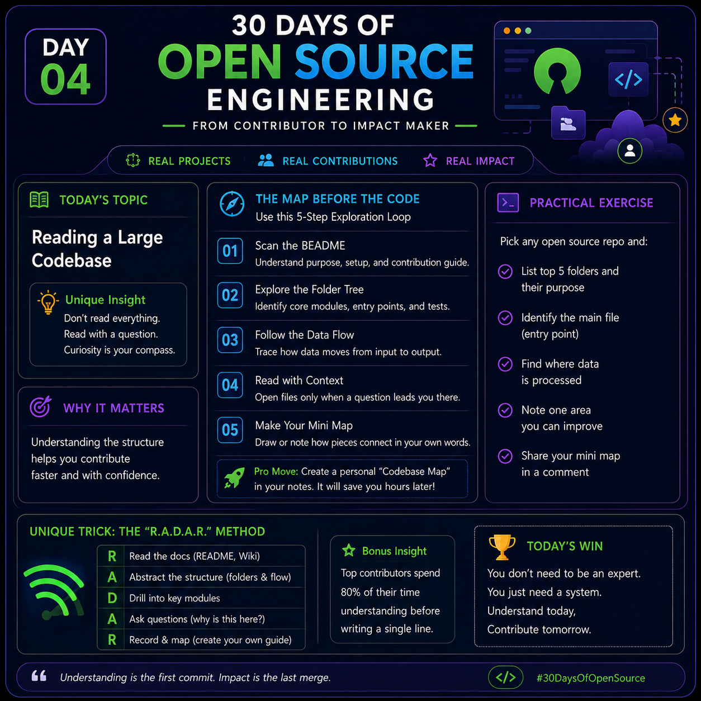

# Day 04 – Reading a Large Codebase

<p>

</p>

> **30 Days of Open Source Engineering**
>
> **Goal:** Learn how to understand an unfamiliar open-source project quickly without reading every file.

---

# 📖 What is a Large Codebase?

A **large codebase** is a software project that contains many files, folders, modules, libraries, and contributors.

Examples:

- React
- VS Code
- Kubernetes
- TensorFlow
- Node.js

Unlike personal projects, large repositories may contain thousands of files written by hundreds of developers.

---

# 🤔 Why is it Difficult?

Most beginners experience these problems:

- 📂 Too many folders
- 📄 Thousands of source files
- 🔄 Difficult execution flow
- ⚙️ Multiple technologies
- ❓ Unknown architecture
- 🧩 Hard to know where to begin

The biggest mistake beginners make is **opening random files**.

Professional developers never do this.

---

# ✅ The MAP Method

Instead of reading everything, follow the **MAP Method**.

## M — Map

Understand the project before understanding the code.

Read:

- README.md
- Project description
- Documentation
- Wiki
- Screenshots

Questions to answer:

- What problem does this project solve?
- Who uses it?
- Which programming language is used?
- Which framework is used?

Example:

```
Project:
Express.js

Purpose:
Fast web framework for Node.js
```

---

## A — Anchor

Find the project's important files.

Typical anchor files:

| Language | Important File |
|-----------|----------------|
| Node.js | package.json |
| Python | requirements.txt / pyproject.toml |
| Java | pom.xml / build.gradle |
| Go | go.mod |
| Rust | Cargo.toml |

Also identify:

- Entry point
- Configuration
- Environment variables
- Dependency manager

---

## P — Path

Follow one complete execution path.

Example:

```
User
   │
   ▼
Browser
   │
   ▼
Route
   │
   ▼
Controller
   │
   ▼
Service
   │
   ▼
Database
   │
   ▼
Response
```

Don't try to understand everything.

Understand **one request completely**.

---

# 📂 Best Folder Reading Order

Read folders in this order:

```
README.md
      │
      ▼
docs/
      │
      ▼
src/
      │
      ▼
tests/
      │
      ▼
.github/
      │
      ▼
Configuration Files
```

Why?

### README

Learn

- Project purpose
- Installation
- Features

---

### docs/

Understand

- Architecture
- APIs
- Design decisions

---

### src/

Actual application source code.

Look for

- main()
- app.js
- index.js
- Program entry

---

### tests/

Tests explain

- Expected behaviour
- Edge cases
- Business rules

Sometimes tests are easier to understand than production code.

---

### .github/

Contains

- GitHub Actions
- CI/CD
- Issue templates
- PR templates

Shows how the project is maintained.

---

# Example (Node.js)

```
awesome-project/

README.md

package.json

src/
    app.js
    routes/
    controllers/
    services/
    models/

tests/

.github/

.env.example
```

Meaning

| File | Purpose |
|------|----------|
| README | Documentation |
| package.json | Dependencies |
| app.js | Entry point |
| routes | API endpoints |
| controllers | Request handling |
| services | Business logic |
| models | Database models |
| tests | Testing |
| .github | Automation |

---

# 🚀 Professional Tips

### Tip 1

Never start coding immediately.

Spend at least **15 minutes understanding** the project.

---

### Tip 2

Search these keywords first.

```
main

index

app

server

start

bootstrap
```

These usually reveal the application's entry point.

---

### Tip 3

Read tests.

Tests reveal

- Expected outputs
- Validation rules
- Business logic

---

### Tip 4

Use VS Code features

- Go to Definition
- Find References
- Global Search
- File Explorer
- Outline View

These tools help you navigate the project faster.

---

# ⭐ Unique Technique — 20-Line Capsule

After exploring the repository, create a one-page summary.

```
Project Name

Purpose (2 lines)

Tech Stack (2 lines)

Architecture (5 lines)

Important Files (5 lines)

Execution Flow (3 lines)

My Learnings (3 lines)
```

This creates a personal knowledge base and helps you revisit the project quickly.

---

# Practical Exercise

Choose any GitHub repository.

Complete these tasks.

- Read README.md
- Identify the entry point
- Find configuration files
- Locate business logic
- Locate test files
- Draw a simple architecture diagram
- Write your own 20-Line Capsule

---

# Key Takeaways

✅ Don't read every file.

✅ Read with a purpose.

✅ Start with documentation.

✅ Find the entry point.

✅ Follow one execution flow.

✅ Understand the architecture before coding.

✅ Take notes while exploring.

---

# Mini Challenge

Choose one popular repository.

Examples:

- React
- Express.js
- Bootstrap
- Flask
- Vue.js

Create a one-page summary containing:

- Purpose
- Folder structure
- Entry point
- Main modules
- Execution flow
- Tech stack

If you can explain the project to someone else in **5 minutes**, you've understood the codebase well.

---

# Tomorrow (Day 05)

## Understanding `CONTRIBUTING.md`

Learn:

- Contribution guidelines
- Coding standards
- Pull Request rules
- Community expectations

---

> **Quote**
>
> *"Great contributors don't read more code—they read the right code in the right order."*