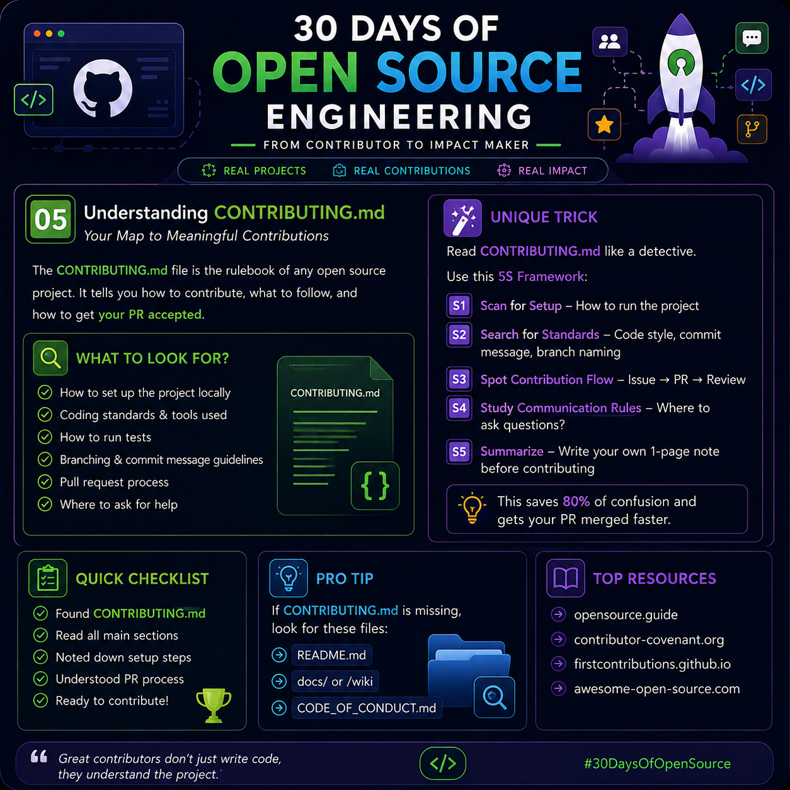

# 🌍 Day 05 — Understanding `CONTRIBUTING.md`

<p>

</p>


> **30 Days of Open Source Engineering — From Contributor to Impact Maker**

---

## 📌 Today's Topic

# Understanding `CONTRIBUTING.md`

When beginners discover an interesting open-source project, their first instinct is often:

> "Where should I start coding?"

But experienced contributors usually ask a different question:

> **"How does this project want me to contribute?"**

That's exactly where `CONTRIBUTING.md` becomes important.

Think of it as the project's **contributor manual**.

It can tell you how to:

- Set up the project
- Find or work on issues
- Create branches
- Write code
- Follow coding standards
- Run tests
- Write commits
- Open Pull Requests
- Communicate with maintainers

Understanding this file **before writing code** can save you from unnecessary mistakes and rework.

---

# 🧠 1. What is `CONTRIBUTING.md`?

`CONTRIBUTING.md` is a documentation file that explains how people should contribute to a project.

A repository might look like this:

```text
project/
│
├── src/
├── tests/
├── docs/
│
├── README.md
├── CONTRIBUTING.md   👈 Read this
├── LICENSE
└── CODE_OF_CONDUCT.md
```

`README.md` usually helps you understand:

> **What does this project do?**

While `CONTRIBUTING.md` usually helps answer:

> **How should I contribute to this project?**

---

# 🗺️ 2. Why Should You Read It?

Imagine you find a bug.

You immediately:

```text
Fork → Code → Commit → Pull Request
```

But later, the maintainer tells you:

```text
❌ Wrong branch naming

❌ Tests are missing

❌ Commit format is incorrect

❌ Issue should have been assigned first

❌ PR template wasn't completed
```

Your code might actually work.

But you didn't follow the project's contribution process.

A better workflow is:

```text
Read Guidelines
      ↓
Understand Project
      ↓
Choose Issue
      ↓
Setup Environment
      ↓
Create Branch
      ↓
Make Change
      ↓
Run Tests
      ↓
Open PR
```

### Important lesson:

> **Good contribution = Good code + Project conventions + Clear communication**

---

# 🔍 3. What Should You Look For?

When reading `CONTRIBUTING.md`, focus on these areas.

---

## ⚙️ A. Development Setup

First understand how to run the project locally.

For example:

```bash
git clone <repository-url>

cd project-name

npm install

npm run dev
```

For a Python project, you might see:

```bash
python -m venv venv

pip install -r requirements.txt

pytest
```

The exact commands depend on the project.

### Your goal:

Before modifying anything, answer:

> **Can I successfully run the existing project?**

If the answer is **no**, don't rush into changing the code.

---

# 🎨 4. Coding Standards

Every project can have its own coding conventions.

For example:

```text
Naming conventions
Formatting
Folder structure
Comments
Linting
Type checking
Testing
Documentation
```

A JavaScript project might require:

```bash
npm run lint
```

A Python project might use:

```bash
black .
```

or:

```bash
ruff check .
```

The important point isn't which tool is used.

The important point is:

> **Follow the standards already established by the project.**

---

# 🧪 5. Understand the Testing Process

Testing is extremely important in open source.

Suppose you fix:

```text
Login button doesn't work
```

You test the button manually.

It works.

Great.

But what if your change accidentally breaks:

```text
Registration
Password Reset
Authentication
Session Management
```

That's why projects often ask contributors to run their test suite.

For example:

```bash
npm test
```

or:

```bash
pytest
```

or:

```bash
mvn test
```

You may also need to add a new test covering your change.

### Think like this:

```text
CHANGE
   ↓
EXPECTED BEHAVIOR
   ↓
TEST
   ↓
RESULT
```

> **Don't only prove that your change works. Check that existing behavior still works too.**

---

# 🌿 6. Branch Naming Rules

Some repositories define how branches should be named.

Examples:

```text
feature/user-authentication

fix/login-validation

docs/update-installation

test/add-login-tests
```

Instead of something unclear like:

```text
mybranch

new-code

final-fix

harshad-test
```

Descriptive branch names make collaboration easier.

---

# ✍️ 7. Commit Message Guidelines

Compare these two commits.

### ❌ Poor commit

```text
fixed stuff
```

### ✅ Better commit

```text
fix: handle invalid email during login
```

Another example:

```text
docs: update local installation instructions
```

Some projects follow specific conventions such as:

```text
feat:
fix:
docs:
test:
refactor:
chore:
```

But never assume a repository uses these conventions.

**Check its contribution guidelines first.**

---

# 🔄 8. Understand the Pull Request Process

Before opening a Pull Request, check what maintainers expect.

A project may ask you to provide:

```text
What changed?

Why was this change needed?

Which issue does it solve?

How was it tested?

Are screenshots required?
```

A simple PR description could look like this:

```md
## What Changed?

Fixed validation for invalid email addresses on the login form.

## Related Issue

Fixes #142

## How Was It Tested?

- Tested valid email login
- Tested invalid email
- Tested empty email
- Ran existing authentication tests

## Screenshots

Added screenshots showing the validation message.
```

This makes the maintainer's job easier.

---

# 🧠 9. The 5S Framework

Instead of randomly reading a large `CONTRIBUTING.md`, use this simple framework.

```text
┌───────────────────────────────────────┐
│        THE 5S FRAMEWORK               │
├───────────────────────────────────────┤
│ S1 → SCAN      → Setup                │
│ S2 → SEARCH    → Standards            │
│ S3 → SPOT      → Contribution Flow    │
│ S4 → STUDY     → Communication        │
│ S5 → SUMMARIZE → Personal Checklist   │
└───────────────────────────────────────┘
```

Let's understand each step.

---

## 🔎 S1 — SCAN for Setup

Search for sections such as:

```text
Getting Started

Installation

Development Setup

Local Development

Building the Project
```

Find out:

```text
What dependencies are required?

How do I install them?

How do I start the project?

How do I run tests?
```

---

## 🔍 S2 — SEARCH for Standards

Look for words such as:

```text
Coding Style

Formatting

Linting

Testing

Branch Naming

Commit Guidelines
```

This tells you how your contribution should be structured.

---

## 🧭 S3 — SPOT the Contribution Flow

Understand the project's preferred workflow.

For example:

```text
Issue
  ↓
Discussion
  ↓
Fork
  ↓
Branch
  ↓
Code
  ↓
Test
  ↓
Commit
  ↓
Pull Request
  ↓
Review
  ↓
Changes
  ↓
Merge 🎉
```

Not every repository uses exactly this process.

That's why reading the contribution guide matters.

---

## 💬 S4 — STUDY Communication Rules

Open source isn't only about code.

It's also about communication.

Find out where questions should be asked.

For example:

```text
GitHub Issues
GitHub Discussions
Discord
Slack
Forum
Mailing List
```

A repository may prefer:

```text
Bug → GitHub Issue

Question → GitHub Discussion

Security Problem → Private security report
```

Following the correct communication channel helps maintainers respond efficiently.

---

## 📝 S5 — SUMMARIZE

After reading the contribution guide, create your own short contributor note.

Example:

```md
## My Contribution Notes

### Setup
npm install

### Run
npm run dev

### Test
npm test

### Lint
npm run lint

### Branch
fix/<issue-name>

### PR
Link issue + explain change + explain testing
```

Now you have a quick reference while working.

---

# 💡 10. Practical Trick — The Contribution Contract

Before touching the code, write four things:

```text
CHANGE
   ↓
PROOF
   ↓
RULE
   ↓
REVIEW
```

Ask yourself:

### CHANGE

What exactly am I changing?

```text
Fix login email validation.
```

### PROOF

How will I prove the change works?

```text
Add tests for invalid email addresses.
```

### RULE

Which repository rules must I follow?

```text
Run linting and tests before creating PR.
```

### REVIEW

What will the maintainer need to understand?

```text
Why the bug happened,
what changed,
and how I tested it.
```

Put everything together:

```text
CHANGE → Fix login validation

PROOF  → Add validation test

RULE   → Follow repository coding standards

REVIEW → Explain problem + solution + testing
```

This encourages you to think not only as a coder but also as a **reviewer**.

---

# 🚨 11. What If `CONTRIBUTING.md` Doesn't Exist?

Not every repository has one.

If it's missing, check:

```text
README.md

docs/

.github/

CODE_OF_CONDUCT.md

GitHub Wiki

Issue Templates

Pull Request Templates
```

You can also inspect previously merged Pull Requests.

They can help you understand patterns such as:

```text
How contributors describe changes

How commits are structured

What maintainers ask during reviews

What tests contributors run
```

But remember:

> Existing PRs can reveal conventions, but they don't automatically create official project rules.

---

# ⚡ 12. Beginner Mistake vs Better Approach

### ❌ Beginner Approach

```text
Find Repository
      ↓
Find Issue
      ↓
Start Coding Immediately
      ↓
Create PR
      ↓
Discover Missing Requirements
      ↓
Rework
```

### ✅ Better Approach

```text
Find Repository
      ↓
Read README
      ↓
Read CONTRIBUTING.md
      ↓
Understand Issue
      ↓
Understand Rules
      ↓
Setup Project
      ↓
Create Branch
      ↓
Code
      ↓
Test
      ↓
Self-Review
      ↓
Create PR
```

A few minutes of preparation can prevent a lot of unnecessary rework.

---

# 🧪 13. Example: Your First Contribution

Suppose you find this issue:

```text
Issue #42

README installation command is outdated.
```

Before editing it:

### Step 1 — Read `CONTRIBUTING.md`

You discover:

```text
Documentation changes are welcome.

Branch format:
docs/<topic>

Run markdownlint before submitting.

Reference the issue in the PR.
```

### Step 2 — Create Branch

```bash
git checkout -b docs/fix-install-command
```

### Step 3 — Make the Change

Update:

```text
Old installation command
```

to:

```text
Correct installation command
```

### Step 4 — Check the Documentation

Run the project's documented validation command.

For example:

```bash
npm run lint:md
```

### Step 5 — Commit

If the repository uses this commit convention:

```bash
git commit -m "docs: fix installation command"
```

### Step 6 — Create PR

Explain:

```text
Problem:
Installation command in README was outdated.

Solution:
Updated the command.

Testing:
Ran the project's documentation checks.

Issue:
Fixes #42
```

Now the maintainer can quickly understand your contribution.

---

# 📋 14. Quick Contributor Checklist

Before submitting your contribution:

- [ ] Read `README.md`
- [ ] Found and read `CONTRIBUTING.md`
- [ ] Understood project setup
- [ ] Successfully ran the project
- [ ] Understood coding standards
- [ ] Checked branch naming rules
- [ ] Checked commit guidelines
- [ ] Ran relevant tests
- [ ] Ran required lint/format checks
- [ ] Reviewed my own changes
- [ ] Followed the PR template
- [ ] Linked the relevant issue when required
- [ ] Explained how the change was tested
- [ ] Ready for code review 🚀

---

# 🧠 15. Mental Model

Remember this simple sequence:

```text
UNDERSTAND
    ↓
FOLLOW
    ↓
BUILD
    ↓
VERIFY
    ↓
EXPLAIN
    ↓
CONTRIBUTE
```

### UNDERSTAND
Understand the project.

### FOLLOW
Follow its contribution rules.

### BUILD
Make the required change.

### VERIFY
Test your work.

### EXPLAIN
Clearly communicate what you changed.

### CONTRIBUTE
Submit your contribution for review.

---

# 🎯 Day 05 Challenge

Today, don't focus on writing lots of code.

Instead:

1. Find an open-source repository.
2. Open its `CONTRIBUTING.md`.
3. Find the setup instructions.
4. Identify coding standards.
5. Find testing instructions.
6. Check branch and commit rules.
7. Understand the PR process.
8. Create your own **5S contribution note**.

Your goal today is simple:

> **Learn how to enter an open-source project correctly before trying to change it.**

---

# 🔑 Key Takeaway

```text
Great Open Source Contribution
            =
     Useful Change
            +
     Project Standards
            +
     Verification
            +
     Clear Communication
```

Writing good code is important.

But successful open-source contributors also understand the project's **rules, workflow, testing process, and communication culture**.

---

## 💭 Final Thought

> **Great contributors don't just write code — they understand the project before changing it.**

---

## 🚀 What's Next?

### Day 06 — Understanding `LICENSE` Files

Next, we'll understand:

- What an open-source license actually does
- Why repositories need licenses
- MIT vs Apache vs GPL
- What you're allowed to use, modify, and distribute
- Why developers should check the license before contributing

---

### 🏷️ Tags

`#30DaysOfOpenSource` `#OpenSource` `#GitHub` `#SoftwareEngineering` `#Developer` `#Programming` `#Git`

---

**Day 05/30 — 30 Days of Open Source Engineering** 🌍

**Learn → Understand → Contribute → Collaborate → Impact**