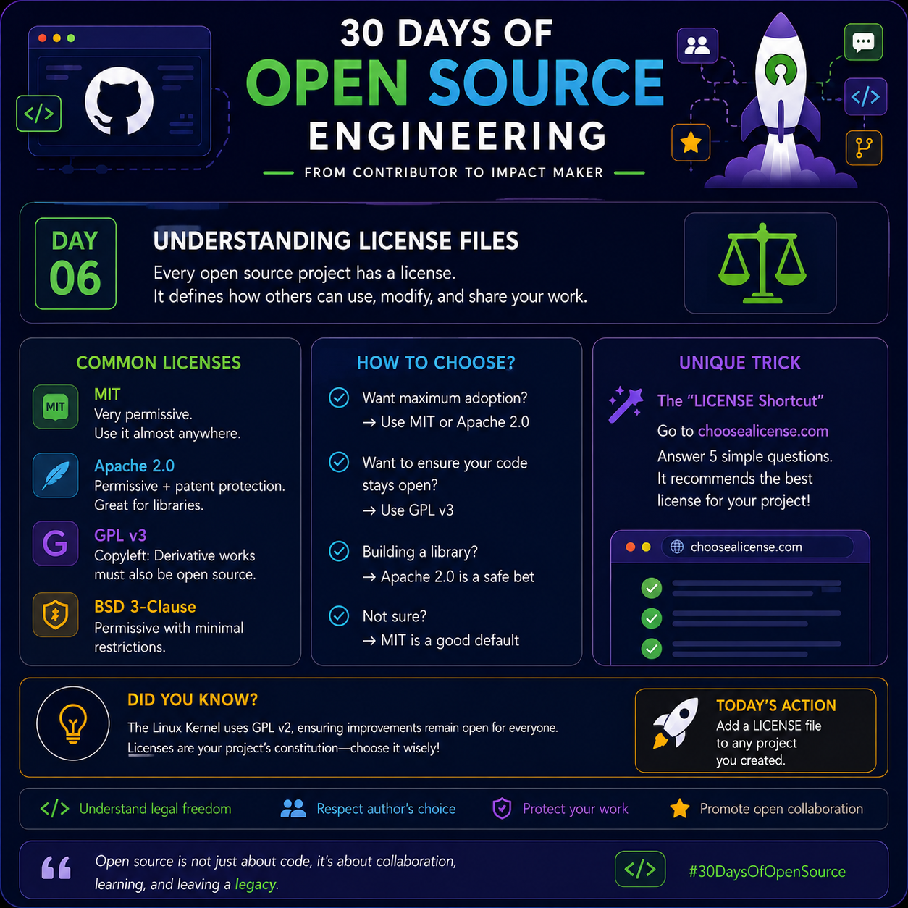

# Day 06 — Understanding LICENSE Files

## 30 Days of Open Source Engineering
<p>

</p>

### Today's Topic: LICENSE Files

A `LICENSE` file is one of the most important files in an open-source project. It tells other people what they are legally allowed to do with your code and what conditions they must follow.

Think of it simply:

**README.md → How to use the project**

**LICENSE → What you are allowed to do with the project**

---

## Why Does a LICENSE Matter?

Just because a project is publicly available on GitHub does not mean that everyone can freely copy, modify, or redistribute its code.

Remember:

**Public GitHub repository ≠ Public domain**

If you create a project and publish it on GitHub without choosing a license, other people should not automatically assume that they have broad permission to reuse your code.

A license makes your intended permissions clear.

---

## What Can a License Allow?

Depending on the license, users may be allowed to:

- Use the software
- Copy the software
- Modify the source code
- Distribute copies
- Use the software commercially
- Include the software in another project
- Create modified versions

A license can also impose conditions.

For example, a license may require users to:

- Keep copyright notices
- Include the license text
- Provide source code in certain redistribution situations
- Preserve certain notices
- Follow specific redistribution requirements

---

# The Four Licenses in This Image

The image highlights four commonly encountered open-source licenses:

1. MIT
2. Apache License 2.0
3. GNU GPL v3
4. BSD 3-Clause

They can be divided into two broad categories:

**Permissive licenses**

- MIT
- Apache 2.0
- BSD 3-Clause

**Copyleft license**

- GPL v3

---

# 1. MIT License

The MIT License is a **permissive open-source license**.

It is popular because it gives downstream users broad freedom.

Generally, MIT allows people to:

- Use the software
- Copy the software
- Modify the software
- Distribute the software
- Use it commercially
- Include it in other projects
- Sublicense it

One important condition is that the copyright notice and permission notice must be preserved in copies or substantial portions of the software.

### Easy way to remember MIT

**MIT = Very permissive**

Think:

```text
MIT
 ↓
Use       ✓
Modify    ✓
Copy      ✓
Distribute ✓
Commercial ✓