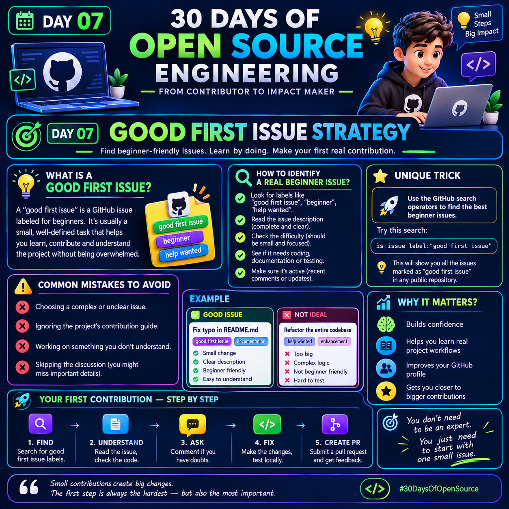

# Day 07 — Good First Issue Strategy

## 30 Days of Open Source Engineering

<p>

</p>

**Day 07 topic:** Good First Issue Strategy

The purpose of this day is to learn how to find a beginner-friendly issue in an open-source project and turn it into your first meaningful contribution.

---

## 🎯 What Is a "Good First Issue"?

A **Good First Issue** is an issue that is suitable for people who are new to contributing to a particular project.

These issues are often:

- Small and focused
- Clearly described
- Relatively easy to understand
- Limited in scope
- Helpful for learning the project's workflow

Common labels you may see include:

```text
good first issue
beginner
help wanted
documentation
easy