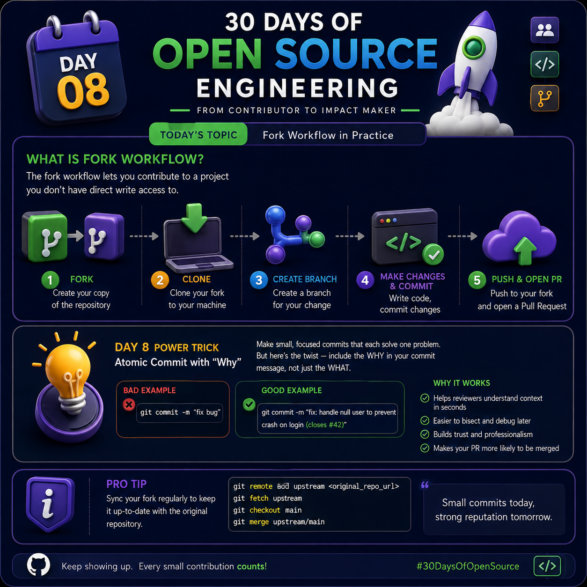

# Day 08 — Fork Workflow in Practice

## 30 Days of Open Source Engineering

<p>



</p>

**Day 08 topic:** Fork Workflow in Practice

The purpose of Day 08 is to understand the **Fork Workflow**, one of the most common workflows used when contributing to open-source projects on GitHub.

When you contribute to an open-source project, you usually do not have direct permission to modify the original repository. Instead, you create your own copy of the repository, work on your copy, and then ask the original project maintainers to review your changes through a **Pull Request**.

The complete workflow is:

```text
Original Repository
        ↓
      Fork
        ↓
    Your Fork
        ↓
      Clone
        ↓
 Create a Branch
        ↓
  Make Changes
        ↓
      Test
        ↓
     Commit
        ↓
      Push
        ↓
 Pull Request
        ↓
  Code Review
        ↓
 Fix Review Comments
        ↓
      Merge