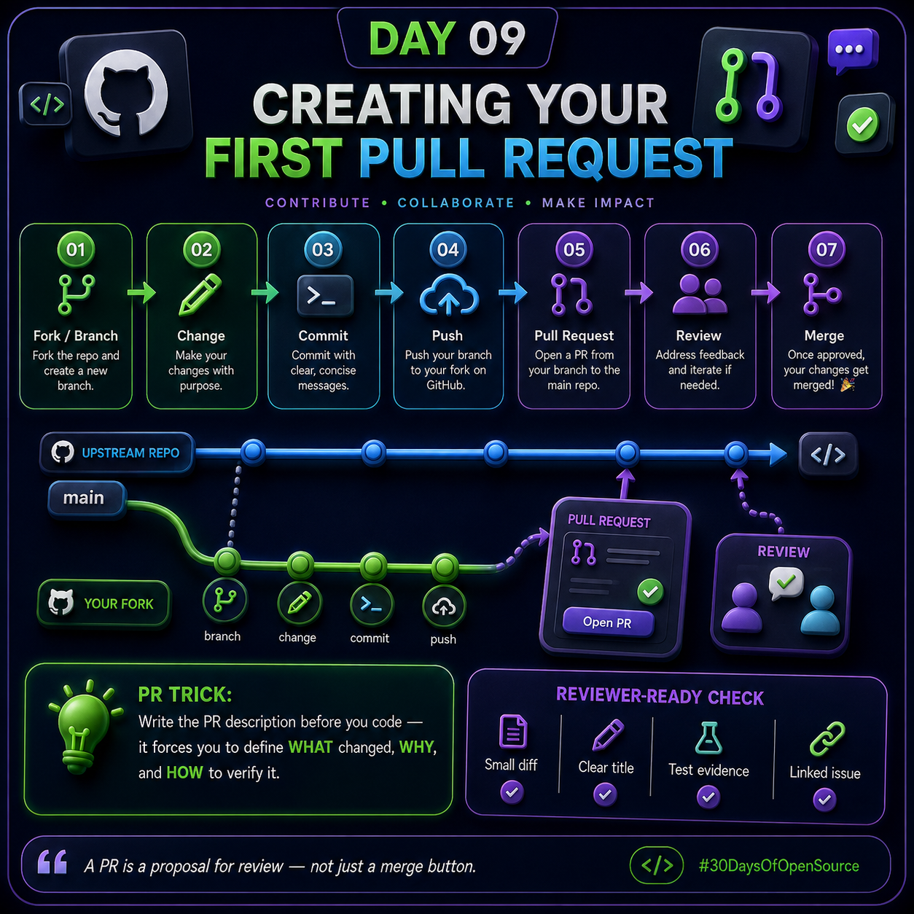

# Day 09 — Creating Your First Pull Request (PR)

<p>



</p>

A **Pull Request (PR)** is one of the most important parts of open-source development. It is the process through which you propose your code changes to the maintainers of a project so they can review, discuss, improve, and eventually merge those changes into the main codebase.

A Pull Request does **not** directly mean that your code will be accepted. Instead, it creates a structured conversation around your changes.

---

## 🎯 What You Will Learn

By the end of Day 09, you should understand:

- What a Pull Request is
- Why Pull Requests are used
- How a fork works
- How to create a feature branch
- How to make changes safely
- How to create a commit
- How to push your branch to GitHub
- How to create a Pull Request
- How code review works
- How to respond to reviewer comments
- What makes a Pull Request easy to review
- How a Pull Request finally gets merged

---

# 1. What Is a Pull Request?

A **Pull Request** is a request asking the maintainers of a repository to review your changes and potentially merge them into the project's codebase.

For example:

```text
Original Repository
        |
        | fork
        ↓
Your GitHub Repository
        |
        | create branch
        ↓
feature/my-change
        |
        | make changes
        ↓
commit
        |
        | push
        ↓
GitHub
        |
        | Pull Request
        ↓
Original Repository
        |
        | review
        ↓
Approved → Merge