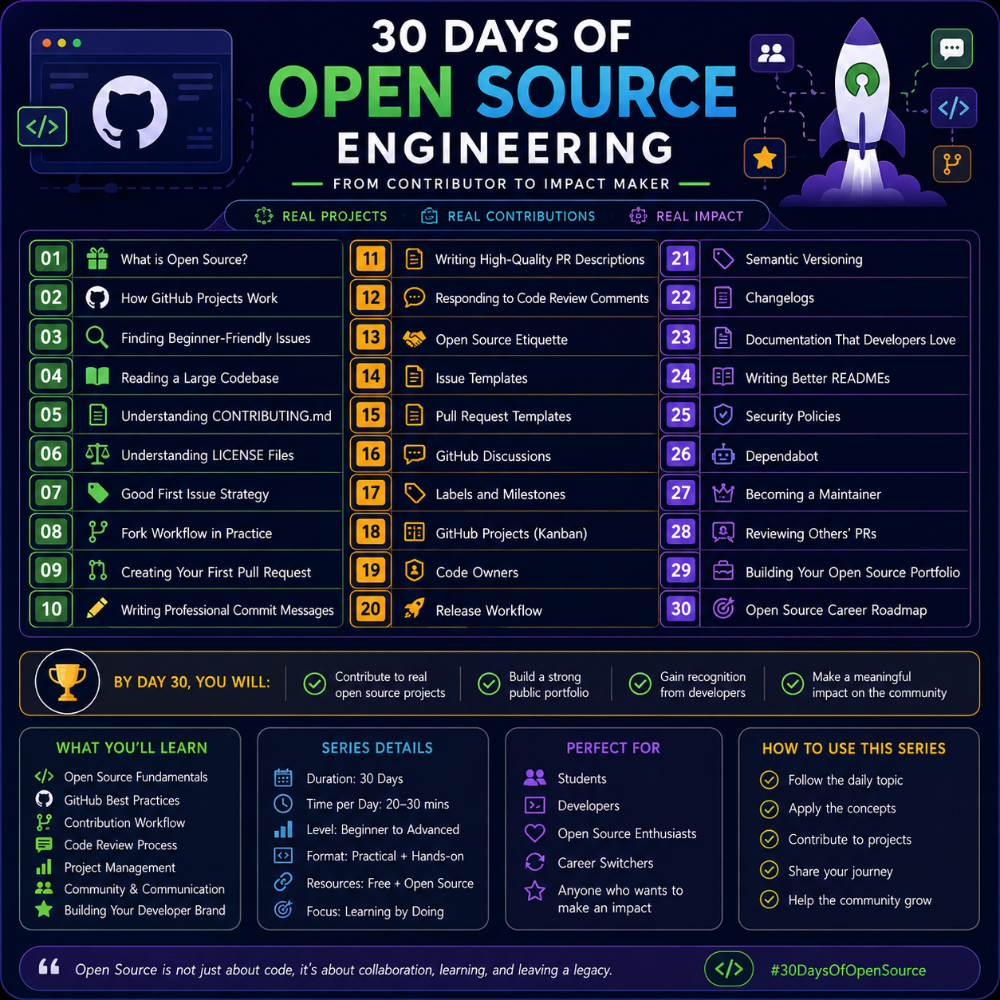

# 🚀 30 Days of Open Source Engineering

<p align="center">
  
</p>

> **From Contributor to Impact Maker**

Learn how real developers contribute to open source, collaborate with engineering teams, submit high-quality pull requests, review code, and build a strong public portfolio.

---

# 📖 About This Series

Open source is much more than writing code.

Professional developers collaborate, review pull requests, maintain documentation, communicate with the community, manage releases, and solve real-world problems together.

This 30-day series is designed to take you from understanding the fundamentals of open source to confidently contributing to real projects on GitHub.

Whether you're a student, a beginner, or an experienced developer, this roadmap will help you develop the practical skills used by software engineers across the industry.

---

# 🎯 What You'll Learn

- Open Source Fundamentals
- GitHub Collaboration Workflow
- Finding Beginner-Friendly Projects
- Reading Large Codebases
- Pull Request Workflow
- Code Reviews
- Documentation Best Practices
- GitHub Project Management
- Semantic Versioning
- Release Management
- Security Best Practices
- Building an Open Source Portfolio
- Becoming an Open Source Maintainer

---

# 🗓️ 30-Day Roadmap

| Day | Topic |
|------|-------|
| 01 | What is Open Source? |
| 02 | How GitHub Projects Work |
| 03 | Finding Beginner-Friendly Issues |
| 04 | Reading a Large Codebase |
| 05 | Understanding CONTRIBUTING.md |
| 06 | Understanding LICENSE Files |
| 07 | Good First Issue Strategy |
| 08 | Fork Workflow in Practice |
| 09 | Creating Your First Pull Request |
| 10 | Writing Professional Commit Messages |
| 11 | Writing High-Quality PR Descriptions |
| 12 | Responding to Code Review Comments |
| 13 | Open Source Etiquette |
| 14 | Issue Templates |
| 15 | Pull Request Templates |
| 16 | GitHub Discussions |
| 17 | Labels & Milestones |
| 18 | GitHub Projects (Kanban) |
| 19 | Code Owners |
| 20 | Release Workflow |
| 21 | Semantic Versioning |
| 22 | Changelogs |
| 23 | Documentation That Developers Love |
| 24 | Writing Better READMEs |
| 25 | Security Policies |
| 26 | Dependabot |
| 27 | Becoming a Maintainer |
| 28 | Reviewing Others' Pull Requests |
| 29 | Building Your Open Source Portfolio |
| 30 | Open Source Career Roadmap |

---

# 📂 Repository Structure

```
30-days-of-open-source-engineering/

├──roadmap
│   
│
├── Day-01/
├── Day-02/
├── Day-03/
...
├── Day-30/
│
└── README.md
```

Each day's folder contains:

- 📖 Concept Explanation
- 💡 Real-World Examples
- 🛠 Practical Exercise
- 📌 Best Practices
- 🎯 Mini Challenge
- 📚 Additional Resources

---

# 💻 Who Is This For?

- Students
- Software Engineers
- Open Source Beginners
- Contributors
- Developers preparing for internships or jobs
- Anyone who wants to build a strong GitHub profile

---

# 📈 How to Use This Repository

1. Follow one topic each day.
2. Read the explanation carefully.
3. Complete the practical exercise.
4. Apply the concept on GitHub.
5. Commit your progress.
6. Share your learning with the community.

Consistency is more valuable than speed.

---

# ⭐ Learning Goals

By the end of this series, you'll be able to:

- Understand how open source projects work
- Make meaningful GitHub contributions
- Submit professional pull requests
- Collaborate effectively with developers
- Read and understand production code
- Build a public portfolio that recruiters can see
- Confidently contribute to real-world software projects

---

# 🤝 Contributing

Suggestions, improvements, and feedback are always welcome.

If you find an issue or have an idea that can improve this repository, feel free to open an Issue or submit a Pull Request.

---

# 🌟 Connect With Me

**Harshad Jibhakate**

GitHub: https://github.com/Hjibhakate

LinkedIn: https://www.linkedin.com/in/harshad-jibhakate-48858b2a7/

---

## ⭐ If you find this project helpful, consider giving it a Star.

It motivates me to continue creating high-quality educational content for the developer community.

Happy Learning! 🚀