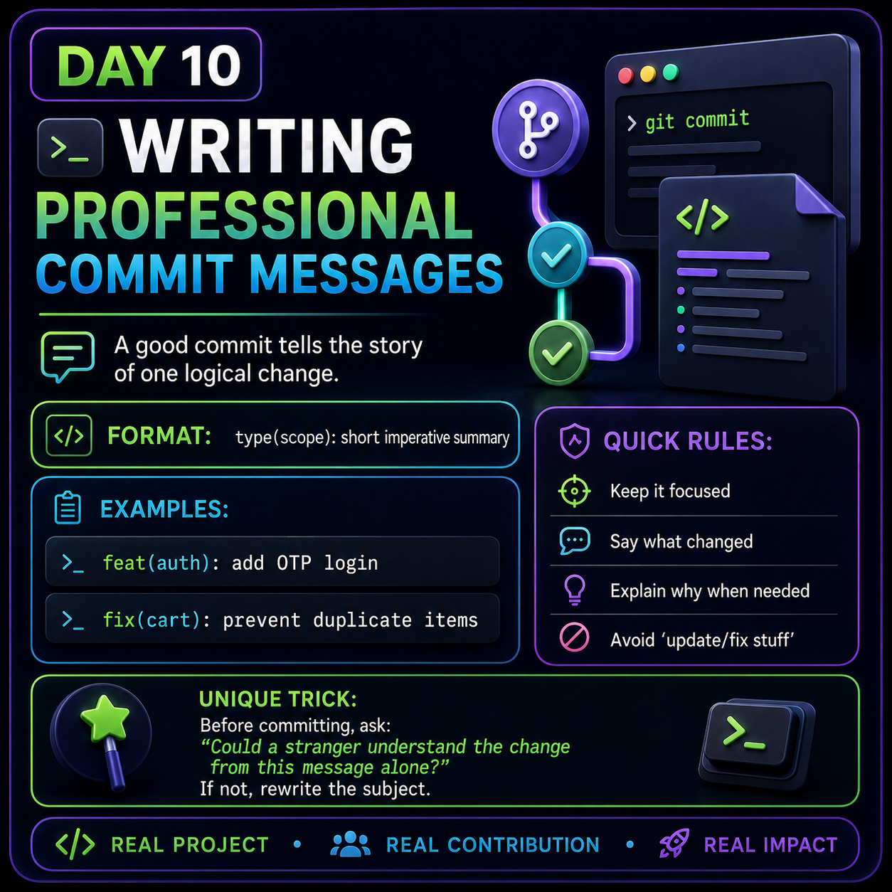

# Day 10 — Writing Professional Commit Messages

<p>



</p>

## 🎯 Goal

Learn how to write clear and professional Git commit messages that help
developers quickly understand what changed in the code.

A good commit message should describe **one logical change** clearly.

---

## 1. What Is a Commit Message?

A commit message is the short description you provide when saving a
set of changes to Git.

Example:

```bash
git add .
git commit -m "fix(cart): prevent duplicate items"