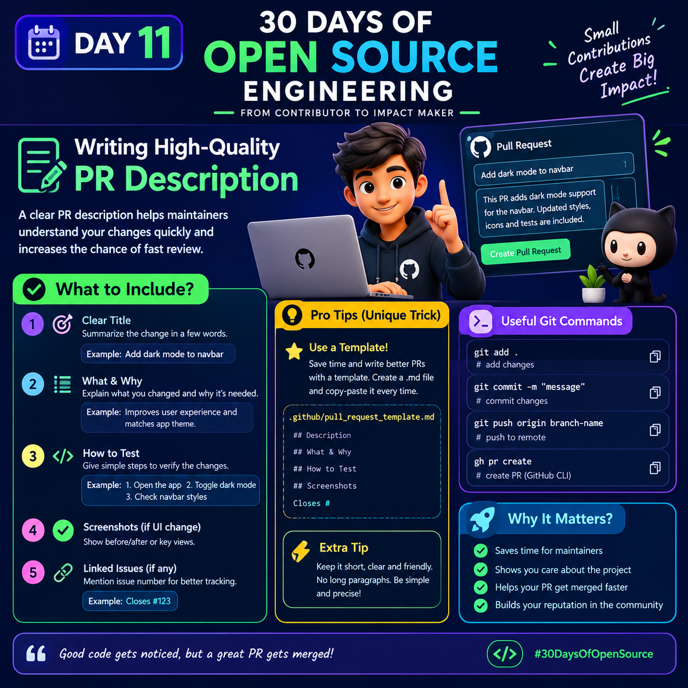

# Day 11 — Writing High-Quality Pull Request (PR) Descriptions
<p>



</p>

A Pull Request (PR) description explains **what you changed, why you changed it, and how someone can verify your changes**.

## What to Include

### 1. Clear Title

Write a short title that clearly describes the change.

**Good:** `Add dark mode support to navbar`

**Avoid:** `Updated code`, `Changes`, `Fixes`

### 2. What & Why

Explain what you changed and why it was needed.

**Example:**

What:
Added dark mode support to the navigation bar.

Why:
The navbar previously did not match the application's dark theme.

### 3. How to Test

Give the reviewer simple and reproducible steps.

1. Open the application.
2. Enable dark mode.
3. Open the navigation bar.
4. Verify that the navbar uses the dark theme.
5. Check that the text and icons remain readable.

### 4. Screenshots

For UI changes, add before/after screenshots when they make the change easier to understand.

### 5. Related Issues

Connect your PR to the relevant GitHub issue.

`Closes #123`

## ⭐ Pro Tip — Use a PR Template

Create this file:

`.github/pull_request_template.md`

Example template:

```markdown
## Description

### What changed?
-

### Why?
-

### How to test?
1.
2.
3.

### Screenshots
-

### Related Issues
Closes #

### Checklist
- [ ] I tested my changes
- [ ] I checked for obvious bugs
- [ ] I followed the project's contribution guidelines
- [ ] I updated documentation if necessary