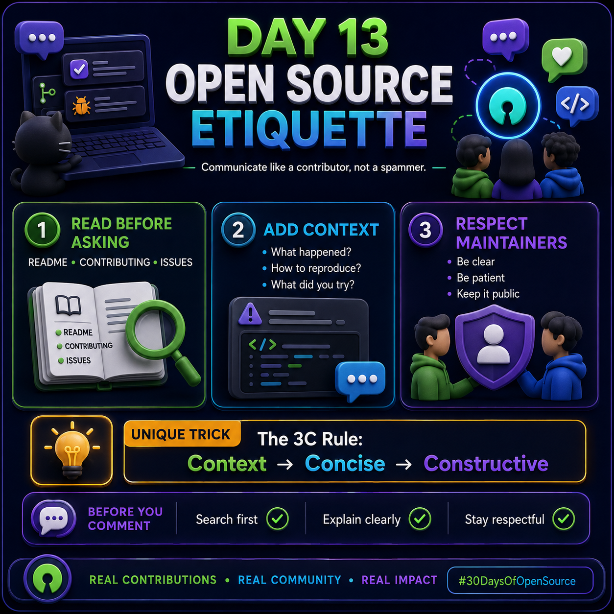

# Day 13 — Open Source Etiquette

## 30 Days of Open Source Engineering

<p>
  
</p>

**Day 13 topic:** Open Source Etiquette

Open source is not only about writing code. It is also about communicating clearly, respecting maintainers, and collaborating professionally with other contributors. Good etiquette makes it easier for maintainers and contributors to understand problems, review changes, and work together.

### 1. Read Before Asking

Before opening an issue or asking a question, first check the project's existing resources.

Look through:

- `README.md`
- `CONTRIBUTING.md`
- Existing Issues
- Discussions
- Documentation

Many common questions may already have an answer. Searching first helps avoid duplicate questions and shows that you have made an effort to understand the project.

### 2. Add Proper Context

When reporting a problem, avoid sending only a message such as:

> "It doesn't work."

Instead, provide enough information for someone else to understand and reproduce the problem.

A useful issue should explain:

- What happened?
- What did you expect to happen?
- How can the problem be reproduced?
- What steps did you try?
- What environment are you using?
- Are there relevant error messages or logs?

For example:

```text
Environment:
Python 3.12
Ubuntu 24.04

Problem:
The application crashes when uploading a CSV file.

Expected:
The CSV should be imported successfully.

Steps:
1. Open the import page.
2. Select a CSV file.
3. Click Import.

Error:
ValueError: invalid column format