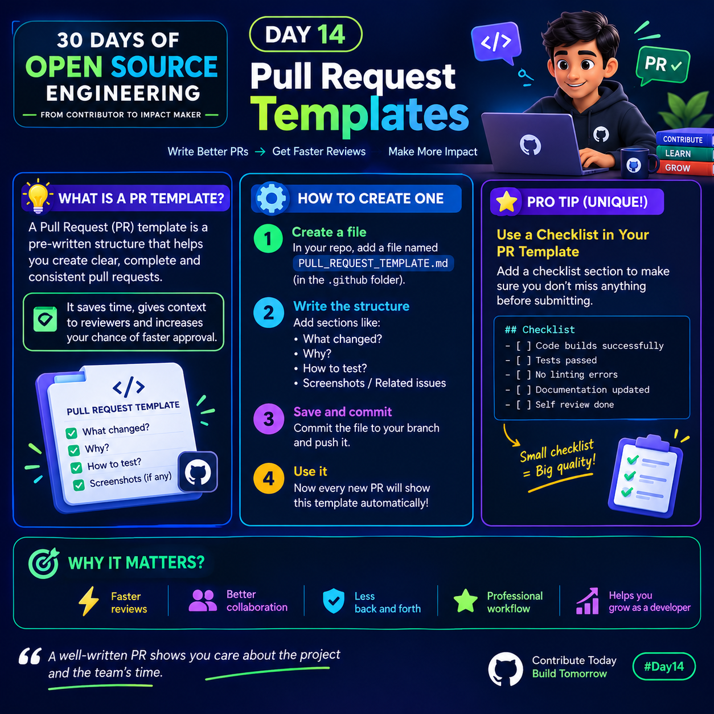

# Day 14 — Pull Request Templates

<p>
  
</p>


## What is a Pull Request Template?

A Pull Request (PR) template is a pre-written structure that helps developers create clear, complete, and consistent Pull Requests.

Instead of writing everything from scratch, the template reminds you to include important information for reviewers.

### Why use a PR Template?

- Saves time when creating Pull Requests
- Gives reviewers clear context
- Reduces missing information
- Makes code reviews smoother
- Creates a professional contribution workflow

---

## How to Create a PR Template

### 1. Create the Template File

Inside your GitHub repository, create:

`.github/PULL_REQUEST_TEMPLATE.md`

You can create the `.github` folder if it doesn't already exist.

### 2. Add a Useful Structure

Example:

```md
## What changed?
<!-- Describe the changes made -->

## Why?
<!-- Explain why this change was needed -->

## How to test?
<!-- Explain how reviewers can test it -->

## Related Issues
<!-- Add issue numbers or links -->

## Checklist
- [ ] Code builds successfully
- [ ] Tests passed
- [ ] No linting errors
- [ ] Documentation updated
- [ ] Self-review completed