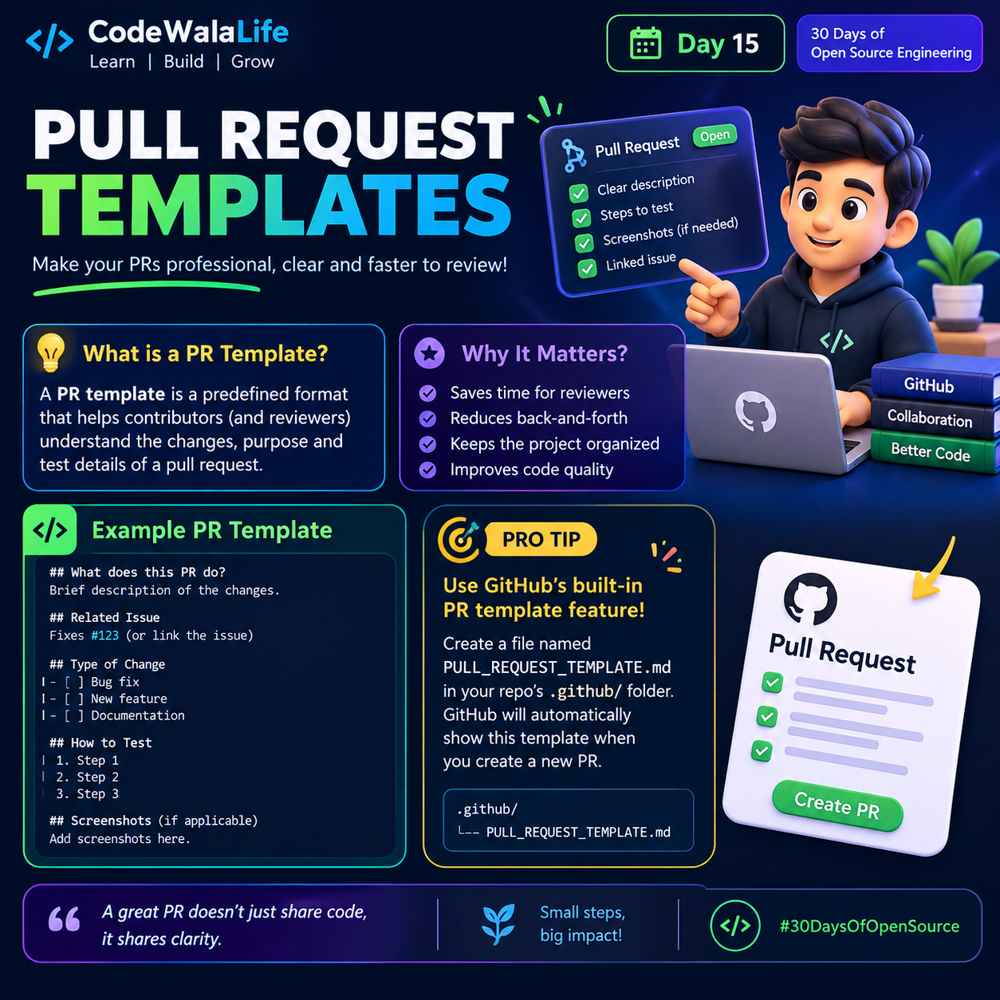

# Day 15 — Pull Request Templates
<p>
  
</p>

## 📌 What is a Pull Request Template?

A **Pull Request (PR) template** is a predefined Markdown format that helps contributors explain their changes clearly when creating a pull request.

It can guide contributors to include:

- What the PR changes
- Related issue
- Type of change
- Testing steps
- Screenshots, when applicable

This makes PRs easier for reviewers to understand and review.

---

## 🚀 Why PR Templates Matter

A good PR template can:

- ⏱️ Save time for reviewers
- 🔄 Reduce unnecessary back-and-forth
- 📁 Keep contributions organized
- ✅ Encourage contributors to provide important testing information
- 👀 Make code reviews easier to understand

---

## 🧩 Example PR Template

Create a file named:

`PULL_REQUEST_TEMPLATE.md`

Example:

```markdown
## What does this PR do?

Brief description of the changes.

## Related Issue

Fixes #123

## Type of Change

- [ ] Bug fix
- [ ] New feature
- [ ] Documentation

## How to Test

1. Step 1
2. Step 2
3. Step 3

## Screenshots

Add screenshots here if applicable.