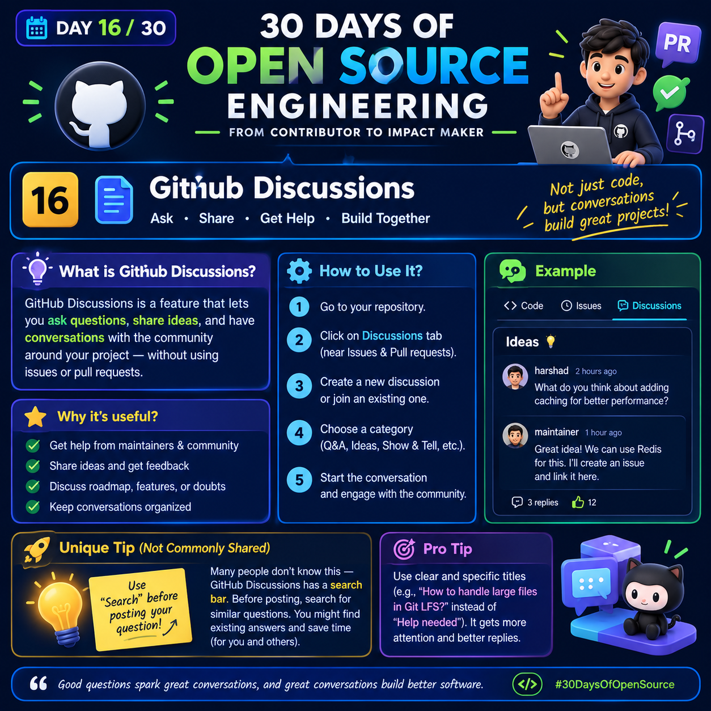

# 🚀 Day 16/30: GitHub Discussions

  

### 30 Days of Open Source Engineering
**From Contributor to Impact Maker**

💬 Ask • Share • Get Help • Build Together

---

## 📌 1. What Are GitHub Discussions?

GitHub Discussions is a feature that allows developers to ask questions, share ideas, exchange knowledge, and communicate with a project's community.

It provides a dedicated space for conversations that do not necessarily require a bug report or code change.

### Example
Suppose you are contributing to an open-source project and want to suggest a new feature.

Instead of creating an issue immediately, you can start a discussion to gather feedback from maintainers and other developers.

**Remember:**
- 💬 Discussions are for questions, ideas, and community conversations.
- 🐛 Issues are generally used to track bugs, tasks, and feature requests.
- 🔀 Pull requests are used to propose and review code changes.

---

## ⭐ 2. Why Are GitHub Discussions Useful?

GitHub Discussions helps open-source communities collaborate more effectively.

### Key Benefits

- ✅ Get help from maintainers and other contributors.
- ✅ Share ideas and receive feedback.
- ✅ Discuss potential features before implementation.
- ✅ Ask technical questions and learn from others.
- ✅ Keep community conversations organized.
- ✅ Help newcomers understand the project.

### Real-World Example

Imagine you want to add caching to an open-source application.

Before writing code, you could ask:

"Would adding Redis caching improve performance in this application?"

Other contributors might suggest alternative caching strategies, explain existing architecture, or recommend discussing the proposal with maintainers.

This can help you understand the problem before starting implementation.

---

## 🛠️ 3. How to Use GitHub Discussions

Follow these steps to participate in a project's discussions.

### Step 1: Open a Repository
Visit the GitHub repository where you want to participate.

### Step 2: Find the Discussions Tab
Look for the **Discussions** tab near Issues and Pull requests.

*Note: Not every repository enables GitHub Discussions.*

### Step 3: Start or Join a Discussion
Depending on your goal, you can:
- Ask a question.
- Share a new idea.
- Participate in an existing conversation.
- Provide helpful answers to other contributors.

### Step 4: Choose a Category
Select an appropriate category if the repository provides categories such as:
- Q&A
- Ideas
- General
- Show and Tell

Available categories depend on the repository's configuration.

### Step 5: Write Your Discussion
Give your discussion a clear title and explain the context.

Include relevant information, expected behavior, and any research you have already done.

### Step 6: Engage With the Community
Respond to questions, consider feedback, and thank contributors who help you.

---

## 💡 4. Practical Example: Proposing a Feature

Imagine you are contributing to an open-source application and want to improve its performance.

### Example Discussion Title

"Could Redis caching improve API response times?"

### Example Discussion Body

**Context:**

Some API endpoints may repeatedly retrieve the same data.

**Idea:**

Would caching frequently requested data with Redis improve response times?

**Questions for the Community:**

1. Does the project already use a caching mechanism?
2. Which endpoints would benefit most from caching?
3. Are there any concerns about stale data?
4. Would a small proof of concept be useful?

**Expected Outcome:**

Gather feedback from maintainers and contributors before deciding whether to implement the feature.

### Possible Follow-Up

After the community discusses the idea, you can create an issue to track an agreed-upon task or submit a pull request when the implementation is ready.

Follow the repository's contribution guidelines.

---

## 🚀 5. Unique Practical Tip: Search Before Posting

Before creating a new discussion, use the repository's search functionality to look for similar questions or existing answers.

### Why Does This Help?

- 🔍 You may find an answer immediately.
- ⏱️ You avoid asking questions that have already been answered.
- 🤝 You can add useful information to an existing conversation.
- 📚 You learn from previous discussions and decisions.

### Try This Search Strategy

Instead of immediately posting:

"How can I improve performance?"

Search for specific terms such as:

- API performance
- Redis caching
- Slow database queries
- Response time optimization

Then check whether an existing discussion addresses your question.

**Important:** Finding a similar discussion does not always mean your problem is identical. If the existing answers do not solve your situation, explain what you have already tried and ask a focused follow-up question.

---

## 🎯 6. Pro Tip: Write Better Discussion Titles

A specific title helps other developers understand your question before opening it.

### ❌ Weak Title
"Help needed"

### ✅ Better Title
"How can I reduce repeated database queries in this API endpoint?"

### Why Is the Second Title Better?

It identifies the technical problem and gives potential respondents enough context to understand the topic.

### Simple Formula

**Problem + Context + Goal**

Example:

"Slow API responses + repeated database queries + improve performance"

Turn this into a natural question:

"How can I reduce repeated database queries to improve API response times?"

---

## 🧠 7. GitHub Discussions vs. Issues vs. Pull Requests

| Feature | Main Purpose | Example |
|---|---|---|
| Discussions | Questions, ideas, and community conversations | Ask whether Redis caching is appropriate |
| Issues | Track bugs, tasks, and proposed work | Track the implementation of caching |
| Pull Requests | Propose and review code changes | Submit the Redis caching implementation |

**Remember:** Projects may use these features differently, so always check the repository's contribution guidelines.

---

## 🏆 8. Day 16 Challenge

Complete this practical activity to improve your open-source collaboration skills.

### Your Tasks

1. Find an open-source repository that enables Discussions.
2. Read its README and contribution guidelines.
3. Search existing discussions for a topic that interests you.
4. Read at least two relevant conversations.
5. Identify one question or idea that is not already adequately answered.
6. Write a clear discussion draft.
7. If appropriate, publish it and participate respectfully in the conversation.

### Challenge Goal

Learn how open-source communities exchange ideas and solve problems before or alongside code contributions.

**Bonus:** Help another contributor by answering a question you genuinely understand.

---

## 📚 9. Key Takeaways

- GitHub Discussions supports community conversations.
- Use Discussions to ask questions and explore ideas.
- Search existing conversations before creating a new post.
- Write specific titles and provide enough context.
- Use Issues to track work and Pull Requests to propose code changes.
- Follow the repository's rules and communicate respectfully.

---

## 💬 Final Thought

"Good questions spark great conversations, and great conversations build better software."

Open source is not just about writing code. It is also about learning, collaborating, sharing knowledge, and helping the community grow.

#30DaysOfOpenSource #GitHub #OpenSource #GitHubDiscussions #SoftwareDevelopment #DeveloperCommunity