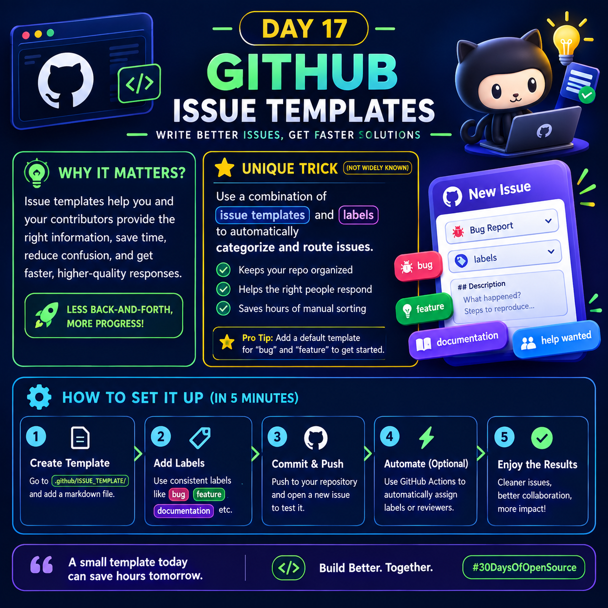

  

TITLE:
DAY 17
GITHUB
ISSUE TEMPLATES

SUBTITLE:
WRITE BETTER ISSUES, GET FASTER SOLUTIONS

MAIN CONTENT:

SECTION 1 — WHY IT MATTERS?
Explain briefly:

"Issue templates help maintainers and contributors provide the right information from the start. They reduce back-and-forth communication, improve issue quality, and make problems easier to triage."

Add a small visual callout:
"LESS BACK-AND-FORTH → MORE PROGRESS"

SECTION 2 — SMART TRICK
Create a visually prominent yellow-highlighted card titled:

"SMART TRICK"

Explain this useful practical technique:

"Pair issue templates with consistent labels and triage rules."

Show the workflow visually:

ISSUE TEMPLATE
↓
STANDARD INFORMATION
↓
CONSISTENT LABEL
↓
FASTER TRIAGE

Mention examples:
🐛 Bug Report → bug
✨ Feature Request → feature
📚 Documentation → documentation

Important:
Do NOT falsely claim that issue templates alone automatically assign labels.
Make the distinction accurate: templates collect structured information, while labels/workflows can be used alongside them for consistent triage and automation.

SECTION 3 — QUICK SETUP
Show a clean 5-step horizontal/vertical workflow:

1. CREATE TEMPLATE
Use GitHub's issue-template configuration.

2. DEFINE QUESTIONS
Ask only for information maintainers actually need.

3. STANDARDIZE LABELS
Use consistent labels such as:
bug / feature / documentation / help wanted

4. TEST THE EXPERIENCE
Open a new issue and verify that the template is clear and useful.

5. IMPROVE OVER TIME
Update templates when recurring questions or missing information appear.

Add a small pro tip:

"Pro Tip: A good template should make the right issue easier to write—not make contributors fill out unnecessary paperwork."

SECTION 4 — EXAMPLE
Create a beautiful 3D mockup of a GitHub-style "New Issue" interface showing:

Bug Report
Labels: bug
Description
Steps to reproduce
Expected behavior
Actual behavior

Beside it, show a small flow:

CLEAR TEMPLATE → BETTER ISSUE → FASTER TRIAGE

3D VISUAL:
Use a cute but professional 3D open-source mascot/developer character working on a laptop, with floating UI cards representing:
- Issue
- Bug
- Feature
- Documentation
- Labels

The 3D elements should support the information rather than dominate it.

UNIQUE VALUE:
Include one genuinely useful, lesser-known practical insight:

"TRICK: Treat your issue template like an API contract—define the minimum information maintainers need to take the next action."

This should be presented as a memorable developer insight.
Keep it truthful: clearly frame it as a practical analogy, not an official GitHub feature.

BOTTOM QUOTE:
"A great issue template doesn't collect more information.
It collects the RIGHT information."

Footer:
</> Build Better. Together.
#30DaysOfOpenSource

DESIGN REQUIREMENTS:
- 1080×1080 Instagram format
- Clean symmetrical composition
- Large readable typography
- No tiny paragraphs
- No excessive text
- Strong contrast
- Plenty of breathing room
- Consistent neon green/cyan/purple/yellow color language
- Subtle 3D depth and realistic lighting
- Rounded futuristic UI cards
- Professional software-engineering aesthetic
- Make it look like a premium educational carousel cover/infographic
- Keep all important text inside safe margins
- Make the information understandable within 5–10 seconds of viewing
- Avoid unnecessary decorative elements
- Do not overcrowd the image
- Ensure spelling is perfect
- Ensure "DAY 17" and "ISSUE TEMPLATES" are unmistakable

The final image should feel:
SIMPLE + PREMIUM + TECHNICAL + VALUABLE + EASY TO UNDERSTAND