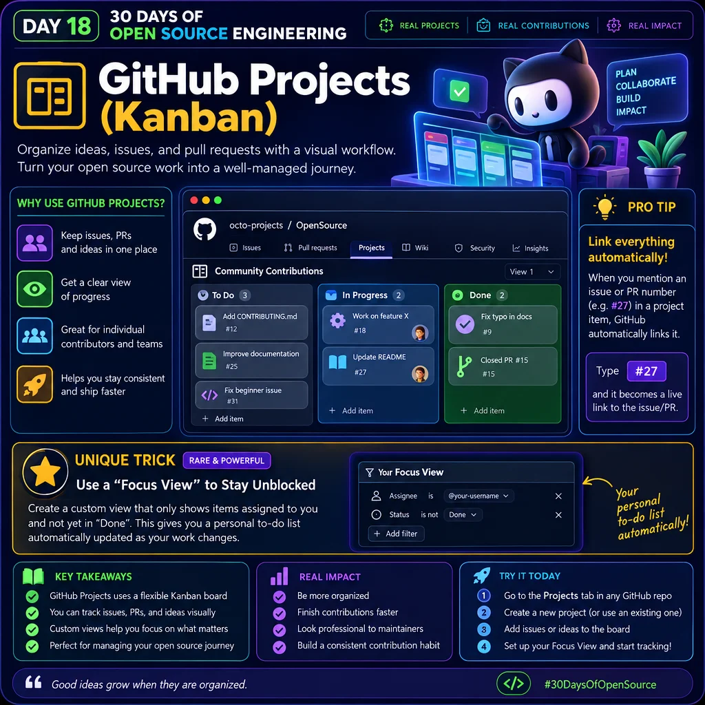

# Day 18 — GitHub Projects (Kanban)
<p>
  
</p>

## What is GitHub Projects?

GitHub Projects is a project-management tool built into GitHub.

It helps you organize:

- Issues
- Pull Requests
- Ideas
- Tasks
- Bugs
- Features
- Open-source contributions

You can arrange these items in a visual board, similar to a **Kanban board**.

A simple workflow can look like:

```text
TO DO
  ↓
IN PROGRESS
  ↓
IN REVIEW
  ↓
DONE