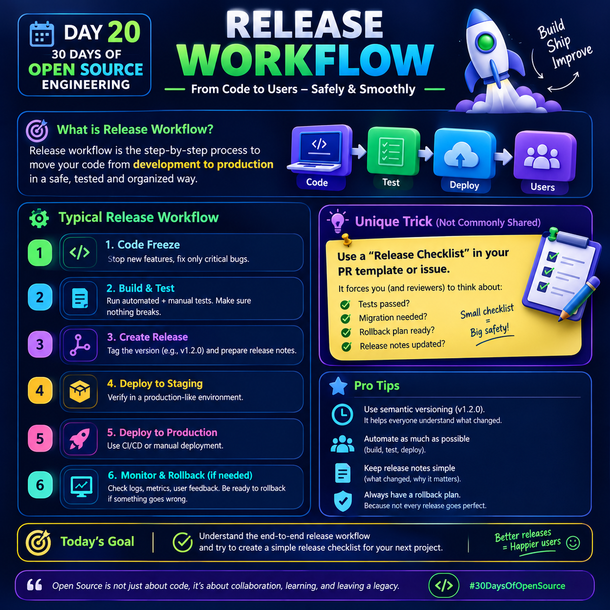

# Day 20 — Release Workflow
<p>
  
</p>

## 1. What is a Release Workflow?

A **release workflow** is the step-by-step process used to move software changes from **development → testing → production → users** in a safe and organized way.

The main goal is not simply to “push code live.” A good release workflow makes sure that:

- The code is tested before release.
- The correct version is identified.
- The deployment is controlled.
- Developers know what changed.
- Users receive a stable version.
- The team can quickly recover if something goes wrong.

### Simple flow:

**Code → Test → Deploy → Users**

Think of it like launching a rocket:

> You don't launch immediately after building it.  
> You check everything, test it, prepare the launch, release it, and monitor what happens.

---

# 2. Typical Release Workflow

## Step 1 — Code Freeze

A **code freeze** means temporarily stopping new feature development before a release.

During this stage, the team normally focuses on:

- Fixing critical bugs.
- Completing final testing.
- Avoiding unnecessary changes.
- Stabilizing the release.

### Example:

Suppose your application is planned for release on Friday.

On Thursday, the team decides:

> “No new features will be added. Only critical bug fixes are allowed.”

This reduces the possibility of introducing new bugs just before production.

### Key idea:

**Code Freeze = Stabilize before release**

---

# 3. Step 2 — Build & Test

After the code is ready, the application needs to be built and tested.

Testing can include:

- Unit testing
- Integration testing
- API testing
- UI testing
- Regression testing
- Manual testing
- Security checks

For example:

```text
Developer changes code
        ↓
Application builds
        ↓
Automated tests run
        ↓
Manual verification
        ↓
Release candidate