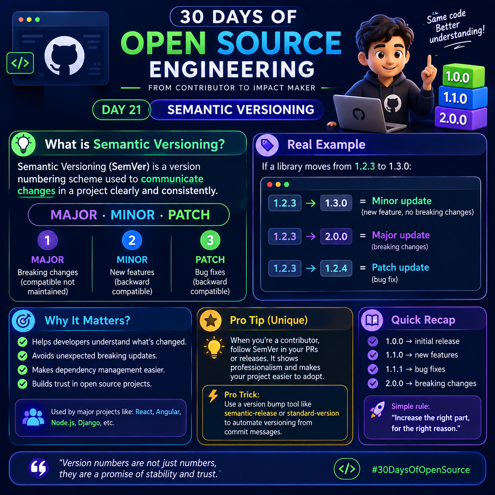

# Day 21: Semantic Versioning (SemVer)

<p>
  
</p>

## 1. What Is Semantic Versioning?

**Semantic Versioning (SemVer)** is a standard way of assigning version numbers to software releases so developers can understand the type of changes introduced in a new version.

It follows this format:

`MAJOR.MINOR.PATCH`

Example: `2.4.1`

* **MAJOR (`2`)**: Changes that are incompatible with the previous version.
* **MINOR (`4`)**: New functionality added in a backward-compatible way.
* **PATCH (`1`)**: Backward-compatible bug fixes.

### Why Is Semantic Versioning Important?

Semantic Versioning helps developers:

* Understand what changed between releases.
* Avoid unexpected breaking changes when updating dependencies.
* Communicate compatibility expectations.
* Manage software dependencies more safely.
* Maintain trust with users and other developers.

---

## 2. Understanding MAJOR, MINOR, and PATCH

### A. MAJOR Version

A MAJOR version increases when a release introduces incompatible API changes.

**Example:**

Version `1.5.2` → `2.0.0`

Suppose a Python library previously provided this function:

```python
def get_user(user_id):
    return {"id": user_id}
```

A new release changes the function so that it requires an additional argument:

```python
def get_user(user_id, include_email):
    return {
        "id": user_id,
        "email": "user@example.com" if include_email else None
    }
```

Existing code calling `get_user(10)` may no longer work. If this is an incompatible API change, it is an example of a reason to increase the MAJOR version.

**Remember:** A MAJOR version increase signals that users may need to modify their code.

### B. MINOR Version

A MINOR version increases when new functionality is added in a backward-compatible way.

**Example:**

Version `1.5.2` → `1.6.0`

Suppose a library originally supports:

```python
def greet(name):
    return f"Hello, {name}!"
```

The developer adds a new function:

```python
def greet_formally(name):
    return f"Good morning, {name}."
```

The existing `greet()` function still works as before. Adding the new function is backward-compatible, so it can justify a MINOR version increase.

**Remember:** MINOR means new features without breaking existing supported functionality.

### C. PATCH Version

A PATCH version increases when backward-compatible bug fixes are released.

**Example:**

Version `1.6.0` → `1.6.1`

Suppose a function incorrectly calculates a discount:

```python
def calculate_discount(price, discount):
    return price - (price * discount / 100)
```

If the original implementation contained a bug and the developer fixes it without introducing an incompatible API change, the correction can be released as a PATCH update.

**Remember:** PATCH means bug fixes that preserve backward compatibility.

---

## 3. Real-World Versioning Examples

Consider a library currently at version `1.2.3`.

| Change                               | Version Change    | Meaning |
| ------------------------------------ | ----------------- | ------- |
| Fix a small bug                      | `1.2.3` → `1.2.4` | PATCH   |
| Add a backward-compatible feature    | `1.2.3` → `1.3.0` | MINOR   |
| Introduce an incompatible API change | `1.2.3` → `2.0.0` | MAJOR   |

When a MINOR version increases, the PATCH number resets to `0`.

When a MAJOR version increases, both the MINOR and PATCH numbers reset to `0`.

For example:

* `1.2.3` → `1.2.4`: PATCH update.
* `1.2.3` → `1.3.0`: MINOR update.
* `1.2.3` → `2.0.0`: MAJOR update.

These examples assume a stable public API and releases that follow Semantic Versioning.

---

## 4. What Does Backward Compatibility Mean?

**Backward compatibility** means that existing supported code continues to work after an update.

For example, suppose version `1.0.0` supports:

```python
def add(a, b):
    return a + b
```

A compatible update adds another function:

```python
def multiply(a, b):
    return a * b
```

Existing code using `add(a, b)` still works, so the new functionality can be a MINOR update.

However, if the developer changes the existing function so that previously valid calls stop working, that may require a MAJOR version increase.

Backward compatibility is an important concept because Semantic Versioning communicates expectations about how upgrades affect users.

---

## 5. The Special Meaning of Version `0.x.y`

In Semantic Versioning, a version beginning with `0`, such as `0.3.0`, indicates initial development.

The public API should not be considered stable, and breaking changes may occur.

Examples:

* `0.1.0`: An early development release.
* `0.2.0`: Additional functionality.
* `0.2.1`: A bug fix.

Before version `1.0.0`, users should be especially careful when updating dependencies because compatibility may change.

Version `1.0.0` defines the point at which the project declares its public API stable.

---

## 6. Pre-release Versions

Developers sometimes publish pre-release versions before a stable release.

Examples:

* `2.0.0-alpha.1`
* `2.0.0-beta.1`
* `2.0.0-rc.1`

Common labels include:

* **Alpha:** An early version that may be incomplete.
* **Beta:** A version available for broader testing.
* **RC (Release Candidate):** A version that may become the final release if no significant problems are found.

These labels describe common development practices, not guarantees about quality or stability.

A pre-release version has lower precedence than the corresponding final version. For example, `2.0.0-rc.1` comes before `2.0.0`.

---

## 7. How to Read Version Numbers Quickly

Use this simple decision method:

1. Did the release introduce an incompatible API change? Increase MAJOR.
2. If not, did it add new backward-compatible functionality? Increase MINOR.
3. If not, did it fix bugs in a backward-compatible way? Increase PATCH.

### Quick Examples

* `3.2.1` → `4.0.0`: Incompatible API change.
* `3.2.1` → `3.3.0`: New backward-compatible functionality.
* `3.2.1` → `3.2.2`: Backward-compatible bug fix.

**Important:** The type of change matters more than the amount of code changed. A one-line API change can be breaking, while hundreds of lines of new internal code can be backward-compatible.

---

## 8. Day 21 Open Source Contributor Workflow

When contributing to an open source project, follow these steps before suggesting a version change.

### Step 1: Understand the Project's Versioning Rules

Read the repository's:

* `README.md`
* `CONTRIBUTING.md`
* `CHANGELOG.md`
* Release notes
* Package or release configuration

Some projects use a versioning policy that differs from SemVer or have additional rules for pre-1.0 releases.

### Step 2: Understand the Impact of Your Change

Ask yourself:

* Does it change an existing public API?
* Does it add a new feature?
* Does it fix a bug?
* Could existing users' code stop working?
* Are tests covering the affected behavior?

### Step 3: Follow the Maintainer's Process

As a contributor, you generally should not change the published version number just because you opened a pull request.

Many projects manage version numbers during their release process. Follow the project's contribution guidelines and let maintainers decide when a release is appropriate.

### Step 4: Explain the Change Clearly

In a pull request, describe the user-visible impact.

For example:

> This pull request adds an optional filtering parameter while preserving the existing default behavior. Existing calls remain compatible.

This helps maintainers evaluate the change and determine the appropriate release category.

---

## 9. Pro Tip: Use Automation for Versioning

Manual version changes can be inconsistent, especially in active repositories.

Tools can help automate release management by using commit conventions, tags, and release configuration.

Examples include:

* **semantic-release:** Automates parts of the release process based on commit messages and project configuration.
* **standard-version:** A changelog and versioning tool historically used with conventional commit workflows; check its current maintenance status before adopting it.
* **Git tags:** Mark specific commits as release points, for example `v1.2.3`.

Automation depends on the project's configuration and workflow. A tool cannot reliably determine compatibility simply by counting changed lines.

### Example Git Commands

Create a version tag:

```bash
git tag v1.2.3
```

Push the tag to the remote repository:

```bash
git push origin v1.2.3
```

Inspect available tags:

```bash
git tag
```

These commands mark or publish a Git tag; they do not automatically update a package's version file or publish a software package.

---

## 10. Common Semantic Versioning Mistakes

### Mistake 1: Increasing PATCH for a Breaking Change

Incorrect assumption: Every small code change is a PATCH.

Correction: Even a one-line incompatible API change may require a MAJOR version increase.

### Mistake 2: Increasing MINOR for a Bug Fix Only

For a stable API, a backward-compatible bug fix normally increases PATCH rather than MINOR.

### Mistake 3: Assuming Every Project Uses SemVer

Not every repository follows Semantic Versioning. Read the project's documentation before interpreting its version numbers.

### Mistake 4: Assuming Version Numbers Guarantee Quality

A version number communicates the project's declared change category and compatibility expectations. It does not prove that the release has no bugs.

### Mistake 5: Changing Version Numbers in Every Pull Request

Versioning is often controlled by maintainers or release automation. Follow the repository's contribution process instead of assuming every contributor should bump the version.

---

## 11. A Practical Exercise

Imagine an open source Python library is currently at version `2.4.1`.

Determine the appropriate next version for each change:

1. A bug is fixed without breaking compatibility.
2. A new optional feature is added without breaking existing behavior.
3. An existing public function is removed.
4. A typo in internal documentation is corrected.

### Answers

1. `2.4.2` — PATCH.
2. `2.5.0` — MINOR.
3. `3.0.0` — MAJOR, assuming the removed function was part of the stable public API.
4. Usually no software version change is required solely for an internal documentation typo; follow the project's release policy.

---

## 12. Quick Revision

| Term                   | Meaning                                                    |
| ---------------------- | ---------------------------------------------------------- |
| MAJOR                  | Incompatible public API changes                            |
| MINOR                  | New backward-compatible functionality                      |
| PATCH                  | Backward-compatible bug fixes                              |
| Backward compatibility | Existing supported code continues to work                  |
| Pre-release            | A version released before the corresponding stable release |
| Git tag                | A named reference to a particular Git commit               |

### The Golden Rule

**Increase the right part of the version number for the right reason.**

* Breaking change → MAJOR.
* New compatible feature → MINOR.
* Compatible bug fix → PATCH.

---

## Conclusion

Semantic Versioning is an important open source engineering practice because it makes software changes easier to communicate and dependency updates easier to manage.

As a contributor, your responsibility is to understand the impact of your changes, describe compatibility clearly in pull requests, and follow the project's release guidelines.

You do not need to manage every release yourself to contribute responsibly to versioning.

**Day 21 takeaway:** Version numbers communicate expectations about compatibility. Use them consistently, document changes clearly, and never assume that a higher version automatically means better quality.

#30DaysOfOpenSource #SemanticVersioning #GitHub #OpenSource #SoftwareEngineering
